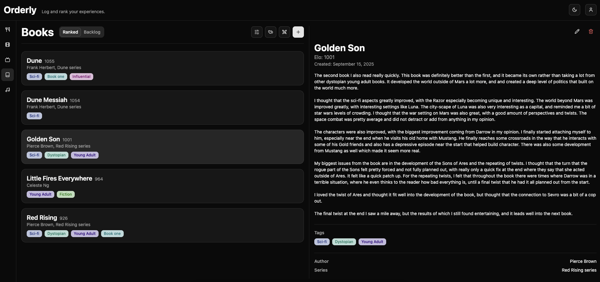
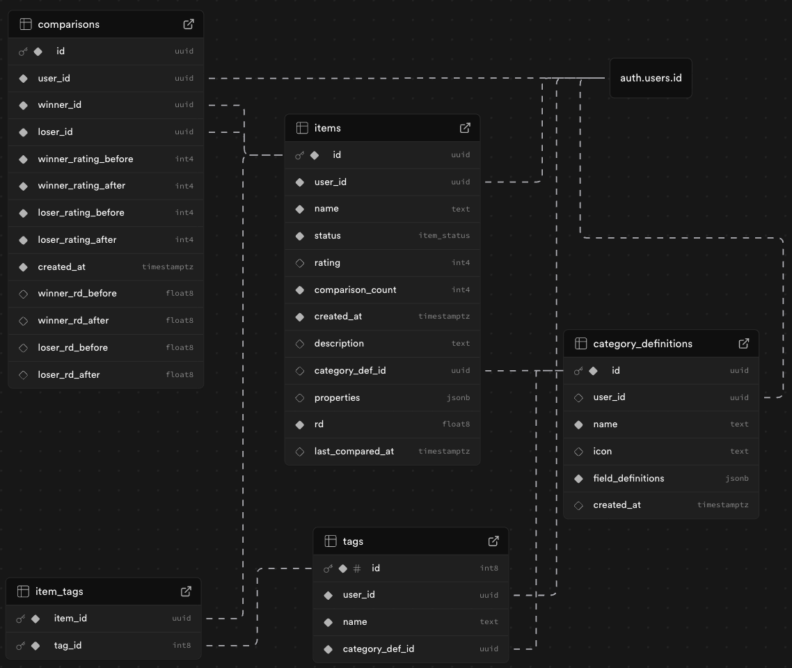

# Orderly

Log and rank your experiences.

## About

I am not a fan of the traditional 5-star rating system. Star ratings are often inflated, subjective, and lack the context to create a truly meaningful, ordered list. This application solves that problem by providing a personalized ranking system that helps you discover what you truly think is best.

The ideal user is anyone who loves to track and rank their experiences. Whether you want to organize a single category or track everything you see, eat, and read, Orderly provides the tools to create a definitive, personal list of your favorites. With features like custom tagging and dynamic data schemas, the system is designed to be completely personal and adaptable to the way you see the world.



## Key Features

- **Head-to-Head Ranking**: Utilizes a Glicko-1 rating system with confidence tracking to create a true, ordered list.
- **Smart Calibration**: New items are quickly placed in their approximate rank via an adaptive binary-search calibration process.
- **Custom Categories**: Categories are fully dynamic. Start with defaults (movies, shows, books, albums, and restaurants), edit them, or build completely custom categories from scratch.
- **Advanced Sorting & Filtering**: Organize, sort, and filter your ranked items based on custom tags and your specific dynamic fields.
- **Responsive Design**: Fully usable on both desktop and mobile.
- **Secure & Private**: All data is tied to a user's private account.

## Tech Stack

- **Frontend**: React, TypeScript, Vite
- **UI**: shadcn, Tailwind CSS
- **Backend & Database**: Supabase (Auth, Postgres, Database Functions)
- **State Management**: React Context & Custom Hooks

## Technical Details

### The Glicko-1 Rating System

The core feature of this application is the ranking system. Items are compared head-to-head using the **Glicko-1 rating system**, an improvement over Elo that tracks a _Ratings Deviation_ (RD) alongside each item's rating. RD represents confidence in the rating — a high RD means the rating is uncertain, while a low RD means it is well-established.

**Expected Score**: The probability of one item winning against another, weighted by both items' confidence.

$$
E_A = \frac{1}{1 + 10^{-g(RD_B) \cdot (R_A - R_B) / 400}}
$$

$$
g(RD) = \frac{1}{\sqrt{1 + 3q^2 \cdot RD^2 / \pi^2}}
$$

> Where $q = \ln(10)/400$, $R_A$ and $R_B$ are ratings, and $RD_B$ is the opponent's ratings deviation

**Rating Update**: An item's new rating after a comparison.

$$
R'_A = R_A + \frac{q}{\frac{1}{RD_A^2} + \frac{1}{d^2}} \cdot g(RD_B) \cdot (S_A - E_A)
$$

> Where $d^2 = 1 / (q^2 \cdot g(RD_B)^2 \cdot E_A \cdot (1 - E_A))$ and $S_A$ is the actual score (1 for a win, 0 for a loss)

**Ratings Deviation Update**: Confidence tightens after each comparison.

$$
RD'_A = \sqrt{\frac{1}{\frac{1}{RD_A^2} + \frac{1}{d^2}}}
$$

**Time Decay**: If an item has not been compared recently, its RD gradually increases back toward the maximum (350), reflecting growing uncertainty.

$$
RD_{\text{current}} = \min\left(350,\; \sqrt{RD_{\text{old}}^2 + c^2 \cdot t}\right)
$$

> Where $c = \sqrt{(350^2 - 30^2) / 90}$ and $t$ is the number of elapsed rating periods (days)

### Comparison Seeding

To keep the ranking system healthy and accurate, item matchups are generated using two distinct modes.

- **Calibration (Adaptive Binary Search)**: New items are put through 3 calibration matchups using a binary search strategy. Each round narrows the search range based on whether the new item won or lost, with positional jitter to avoid always matching against the same "gatekeeper" items. This quickly estimates where a new item belongs.
- **Normal Comparison (Three-Tier Seeding)**: The system generates a queue of up to 100 unique comparisons using three tiers:
  - **Uncertain pairs** (up to 20): Items with high RD (low confidence) are prioritized because their ratings benefit most from additional data.
  - **Similar pairs** (up to ~65): Items that are close in rating or list position. The similarity threshold is dynamic, based on the category's average RD — items whose confidence intervals overlap are still meaningfully comparable.
  - **Random pairs** (remainder): Random matchups to prevent stagnation and allow for major upsets.

### Database Schema

The database is designed around a central `items` table, which stores the core information for every entity a user can rank.

Instead of rigid, category-specific tables, Orderly utilizes a dynamic schema approach. A `category_definitions` table stores the custom field configurations (the schema) for each category. The `items` table then uses a flexible JSON data column to store the specific properties of an item based on its category's schema.

Each item also tracks a `rd` (Ratings Deviation) value representing rating confidence and a `last_compared_at` timestamp used for time-based RD decay.

A `tags` table and a many-to-many `item_tags` junction table provide the flexible tagging system. Finally, a `comparisons` table logs the history of every matchup, including RD snapshots before and after each comparison.



## Roadmap

### Advanced Location & Recommendation Algorithm

Currently, the `location` field type stores and displays an address string. In a future update, this will be expanded to combine a location's _quality_ (Elo rating) and _convenience_ (distance from the user) to provide an ordered list of recommendations.

Locations will be converted to latitude and longitude coordinates using **geocoding** (e.g., via the OpenCage free tier). The **Geolocation API** will be used for retrieving the user's current coordinates.

The distance between the user and item coordinates will be calculated using the **Haversine Formula**:

$$
a = sin^2(\dfrac{\Delta\phi}{2}) + cos(\phi_2) \cdot sin^2(\dfrac{\Delta\lambda}{2})
$$

$$
c = 2 \cdot atan^2(\sqrt{a}, \sqrt{1 - a})
$$

$$
d = R \cdot c
$$

> Where $c$ is the central angle, $R$ is the Earth's radius, and $d$ is the final distance

Calculating distance using actual driving distance could be implemented in the future using a service like **Openrouteservice**.

### Matchup History

View the real-time rise and fall of items as a graph.

## Getting Started

This project uses Supabase for its backend and database. As the database contains sensitive user data, the production keys are not included in this repository. To run this project locally, you will need to set up your own Supabase project.

1. Clone the repositiory: `git clone https://github.com/michael-antar/orderly.git`
2. Install npm packages: `npm install`
3. Set up your enviornment:
   - Create a new file in the root of the project named `.env.local`
   - Add your Supabase Project URL and Anon Key to this file:

     ```
     VITE_SUPABASE_URL=YOUR_SUPABASE_URL
     VITE_SUPABASE_ANON_KEY=YOUR_SUPABASE_ANON_KEY
     ```

   - You will also need to apply the database schema, including the custom SQL functions, to your own Supabase project

## Usage

- Start the development server: `npm run dev`
- Build for production: `npm run build`
- Format all files with Prettier: `npm run format`
