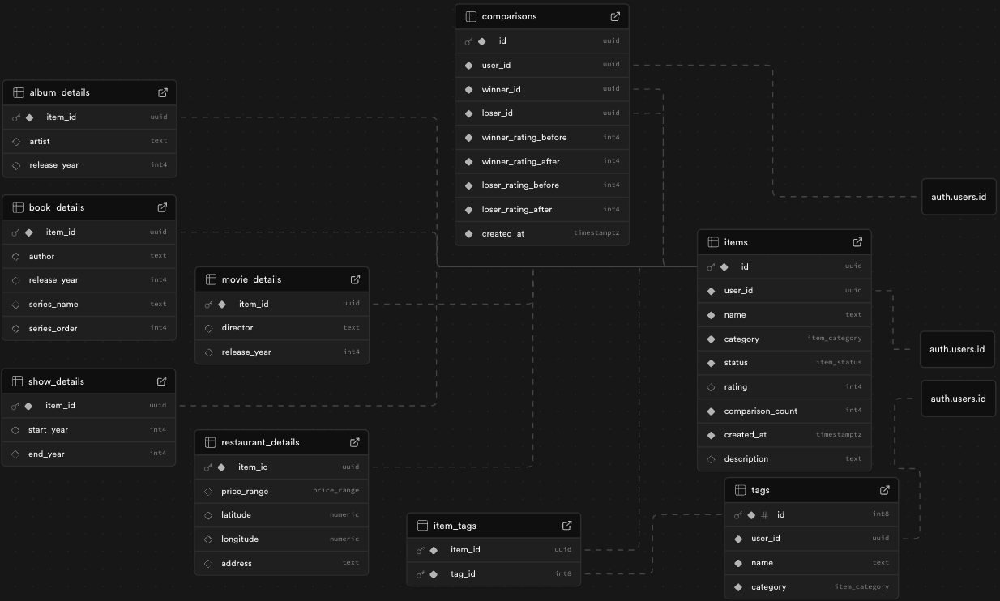

# Orderly

Log and rank your experiences.

## About

I am not a fan of the traditional 5-star rating system. Star ratings are often inflated, subjective, and lack the context to create a truly meaningful, ordered list. This application solves that problem by providing a personalized ranking system that helps you discover what you truly think is best.

The ideal user is anyone who loves to track and rank their experiences. Whether you want to organize a single category or track everything you see, eat, and read, Orderly provides the tools to create a definitive, personal list of your favorites. With features like custom tagging and dynamic data schemas, the system is designed to be completely personal and adaptable to the way you see the world.


## Key Features

- **Head-to-Head Ranking**: Utilizes an Elo-based system to create a true, ordered list.
- **Smart Calibration**: New items are quickly placed in their approximate rank with just a few initial comparisons.
- **Custom Categories**: Categories are fully dynamic. Start with defaults (movies, shows, books, albums, and restaurants), edit them, or build completely custom categories from scratch.
- **Advanced Sorting & Filtering**: Organize, sort, and filter your ranked items based on custom tags and your specific dynamic fields.
- **Responsive Design**: Fully usable on both desktop and mobile.
- **Secure & Private**: All data is tied to a user's private account.

## Tech Stack

- **Frontend**: React, TypeScript, Vite
- **UI**: shadcn, Tailwind CSS
- **Backend & Database**: Supabase (Auth, Postgres, Database Functions)
- **State Management**: React Context & Custom Hooks

## Technical Details

### The Elo Ranking System

The core feature of this application is the ranking system. It will pin items against each other in matches using the _Elo rating system_.

**Expected Score**: The probability of one item winning against another based on their current ratings.

$$
E_A = \frac{1}{1 + 10\frac{R_B - R_A}{400}}
$$

> Where $E_A$ is the expected score for item A, and $R_A$ and $R_B$ are the current ratings for items A and B

**Rating Update**: An item's new rating after a match.

$$
R'_A = R_A + K \times (S_A - E_A)
$$

> Where $R'_A$ is the new rating, $R_A$ is the current rating, $K$ is the **K-factor**, $S_A$ is the actual score (1 for a win, 0 for a loss), and $E_A$ is the expected score

**K-Factor**: A variable that determines the maximum possible rating change from a single comparison. The K-factor will be dynamically adjusted as an item becomes more established. A new item will start with a high K-factor of 40, then lower to 20 after 15 matches, and finally 10 after 30 comparisons.

### Comparison Seeding

To keep the ranking system healthy and accurate, item matchups are generated using two distinct modes.

- **Calibration**: New items are put through 3 initial "calibration" matchups against items at the top, middle, and bottom of the list to quickly find their approximate rank.
- **Normal Comparison**: The system generates a queue of up to 100 unique comparisons. It seeds up to 85 "similar" comparisons (items with a similar Elo rating or list position) to refine the rankings, and 15 random comparisons to prevent stagnation and allow for major upsets. This blend ensures that the list remains fluid and accurate over time.

### Database Schema

The database is designed around a central `items` table, which stores the core information for every entity a user can rank.

Instead of rigid, category-specific tables, Orderly utilizes a dynamic schema approach. A `category_definitions` table stores the custom field configurations (the schema) for each category. The `items` table then uses a flexible JSON data column to store the specific properties of an item based on its category's schema.

A `tags` table and a many-to-many `item_tags` junction table provide the flexible tagging system. Finally, a `comparisons` table logs the history of every matchup to track Elo rating changes over time.



## Roadmap

### Glicko Rating System

(Used by popular games like Counter-Strike and chess sites). A more modern approach to the Elo-based system that takes into account the _staleness_ of an item. The rating of an item that has not been matched in a long time might be unreliable, so we take into account a **ratings deviation**. An implementation of the **Glicko-2 System**, which takes into account volatility when on a win or lose streak, can also be considered in the future.

### Advanced Location & Recommendation Algorithm

Currently, the `location` field type stores and displays an address string. In a future update, this will be expanded to combine a location's _quality_ (Elo rating) and _convenience_ (distance from the user) to provide an ordered list of recommendations.

Locations will be converted to latitude and longitude coordinates using **geocoding** (e.g., via the OpenCage free tier). The **Geolocation API** will be used for retrieving the user's current coordinates.

The distance between the user and item coordinates will be calculated using the **Haversine Formula**:

$$
a = sin^2(\dfrac{\Delta\phi}{2}) + cos(\phi_2) \cdot sin^2(\dfrac{\Delta\lambda}{2})
$$

$$
c = 2 \cdot atan^2(\sqrt{a}, \sqrt{1 - a})
$$

$$
d = R \cdot c
$$

> Where $c$ is the central angle, $R$ is the Earth's radius, and $d$ is the final distance

Calculating distance using actual driving distance could be implemented in the future using a service like **Openrouteservice**.

### Matchup History

View the real-time rise and fall of items as a graph.

## Getting Started

This project uses Supabase for its backend and database. As the database contains sensitive user data, the production keys are not included in this repository. To run this project locally, you will need to set up your own Supabase project.

1. Clone the repositiory: `git clone https://github.com/michael-antar/orderly.git`
2. Install npm packages: `npm install`
3. Set up your enviornment:
    - Create a new file in the root of the project named `.env.local`
    - Add your Supabase Project URL and Anon Key to this file:

        ```
        VITE_SUPABASE_URL=YOUR_SUPABASE_URL
        VITE_SUPABASE_ANON_KEY=YOUR_SUPABASE_ANON_KEY
        ```

    - You will also need to apply the database schema, including the custom SQL functions, to your own Supabase project

## Usage

- Start the development server: `npm run dev`
- Build for production: `npm run build`
- Format all files with Prettier: `npm run format`
